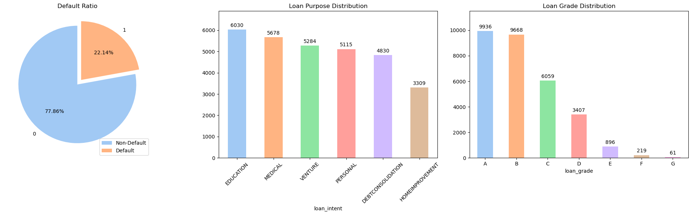
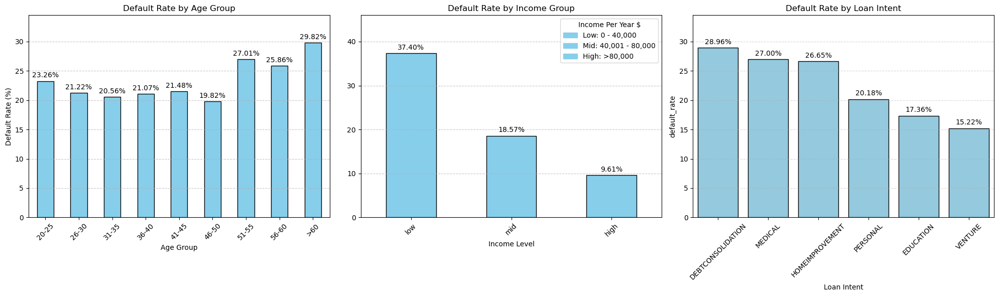
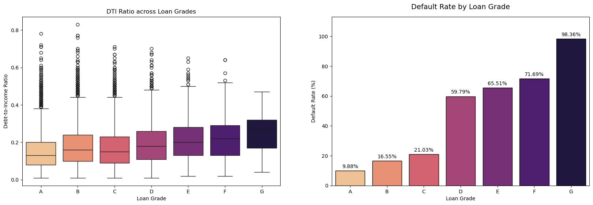
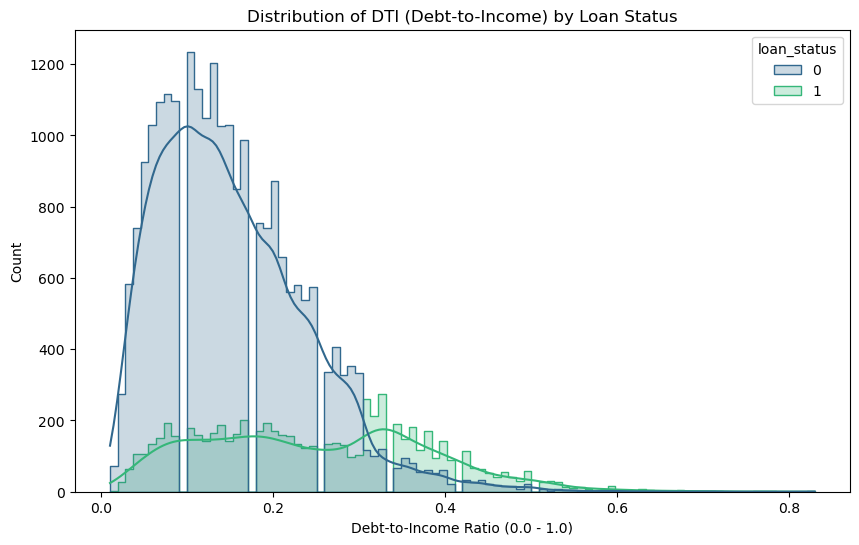
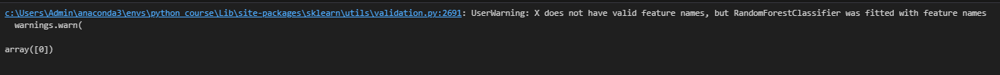

# Credit Risk Analysis 

## Project Overview

The data sourced from [Kaggle](https://www.kaggle.com/datasets/laotse/credit-risk-dataset)

This project focuses on analyzing borrower data to identify key risk factors and predict loan default probabilities. As a Data Analyst, my goal was to transform raw financial data into actionable insights that can help financial institutions mitigate credit risk and improve loan approval strategies

## The Questions
1.Who is risky? (Which type of person is the riskiest?)

2.How well do loan grades predict actual default rates?

3.At what level should we set the DTI threshold to balance risk reduction and customer retention?


## Tools
Language: Python

Data Manipulation: Pandas, NumPy

Visualization: Matplotlib, Seaborn

Machine Learning: Scikit-learn (Random Forest Classifier)

Interactive Tooling: Ipywidgets

## Data Preparation and Cleanup

Here is some code I used to prepare and clean the data

```python 
import ast
import pandas as pd
import numpy as np
import matplotlib.pyplot as plt
import seaborn as sns
from matplotlib.ticker import PercentFormatter
import opendatasets as od
import plotly.express as px
import matplotlib.patches as mpatches

od.download("https://www.kaggle.com/datasets/laotse/credit-risk-dataset/data") 

df = pd.read_csv("credit-risk-dataset/credit_risk_dataset.csv")
```

```python 
#clean outiler data
df_cleaned = df_cleaned[df_cleaned['person_age'] <= 80]

df_cleaned = df_cleaned[df_cleaned['person_emp_length'] <= 41]

df_cleaned = df_cleaned[df_cleaned['person_income'] < 150000]
```
```python 
#fill nan data by median
median_loan_int_rate = df_cleaned['loan_int_rate'].median()

df_cleaned['loan_int_rate'] = df_cleaned['loan_int_rate'].fillna(median_loan_int_rate)
```

## The Analysis

```python 
fig, (ax1, ax2, ax3) = plt.subplots(1, 3, figsize=(20, 6))

#ax1
df_cleaned['loan_status'].value_counts().plot(kind='pie' , startangle=90, autopct='%1.2f%%', colors=pastel, explode=(0, 0.1), ax=ax1)
ax1.set_title('Default Ratio')
ax1.legend(labels=['Non-Default', 'Default'])
ax1.set_ylabel('')

#ax2
df_cleaned['loan_intent'].value_counts().plot(kind='bar',color=pastel, ax=ax2)
ax2.set_title('Loan Purpose Distribution')
ax2.bar_label(ax2.containers[0], label_type='edge', padding=3, fontsize=10)
ax2.set_ylabel('')
ax2.set_ylim(0,6000 *1.15)
ax2.tick_params(axis='x', rotation=45)

#ax3
ax3 = df_cleaned['loan_grade'].value_counts().plot(kind='bar' , color=pastel)

ax3.bar_label(ax3.containers[0], label_type='edge', padding=3, fontsize=10)
ax3.set_title('Loan Grade Distribution')
ax3.set_ylabel('')
ax3.set_ylim(0,10000 *1.15)
ax3.tick_params(axis='x', rotation=0)

plt.tight_layout()
plt.show()
```



1.Default Ratio

With a default rate of 22.14% (nearly 25%), our initial findings indicate a significant risk level. This necessitates deeper analysis to identify key drivers and implement strategies to lower this rate.

2.Loan Purpose Distribution

The loan requests are categorized into six primary intents. Ranked from highest to lowest volume, the distribution is as follows: Education, Medical, Venture, Personal, Debt Consolidation, and Home Improvement.

3.Loan Grade Distribution

The majority of customers are concentrated in Grades A and B (nearly 20,000 cases), while high-risk grades (E, F, G) remain minimal. This suggests that the current lending policy is relatively conservative.

```python 
fig, (ax1, ax2, ax3) = plt.subplots(1, 3, figsize=(20, 6))

#ax1
age_group_ratio['default_rate'].plot(kind='bar', color='skyblue', edgecolor='black', ax=ax1)
ax1.bar_label(ax1.containers[0], padding=3, fmt='%.2f%%')
ax1.set_title('Default Rate by Age Group')
ax1.set_xlabel('Age Group')
ax1.set_ylabel('Default Rate (%)')
ax1.tick_params(axis='x', rotation=45)
ax1.set_ylim(0,30*1.15)
ax1.grid(axis='y', linestyle='--', alpha=0.7)

#ax2
income_group_ratio['default_rate'].plot(kind='bar', color='skyblue', edgecolor='black', ax=ax2)
ax2.bar_label(ax2.containers[0], padding=3, fmt='%.2f%%')
ax2.legend(handles=[low_patch, mid_patch, high_patch], 
          title="Income Per Year $", 
          loc='upper right')
ax2.set_title('Default Rate by Income Group')
ax2.set_xlabel('Income Level')
ax2.tick_params(axis='x', rotation=45)
ax2.set_ylim(0,40*1.15)
ax2.grid(axis='y', linestyle='--', alpha=0.7)

#ax3
sns.barplot(data=loan_intent_group_ratio, x='loan_intent', y='default_rate', 
            color='skyblue', legend=False, edgecolor='black', ax=ax3)
for container in ax3.containers:
    ax3.bar_label(container, fmt='%.2f%%', padding=3)
ax3.set_title('Default Rate by Loan Intent')
ax3.set_xlabel('Loan Intent')
ax3.tick_params(axis='x', rotation=45)
ax3.set_ylim(0,30*1.15)
ax3.grid(axis='y', linestyle='--', alpha=0.5)

plt.tight_layout()
plt.show()
```



1.Default Rate by Age Group

The highest default risk is concentrated among seniors (>60 years) at 29.82%, closely followed by the pre-retirement segment (51-55 years). Crucially, a default probability exceeding 25% is observed across all borrowers aged 51 and older.

2.Default Rate by Income Group

The chart reveals a clear negative correlation between income levels and default rates; as annual income increases, the likelihood of default significantly decreases. Consequently, the company’s lending policy should prioritize more stringent screening for borrowers earning under $40,000 per year to effectively mitigate potential losses.

3.Default Rate by Loan Intent

The top three categories with the highest default probability are Debt Consolidation, Medical, and Home Improvement. Consequently, stricter lending criteria should be implemented for these segments. Conversely, Venture, Education, and Personal loans exhibit the lowest risk profiles.

```python
fig, (ax1, ax2) = plt.subplots(1, 2, figsize=(20, 6))

#ax1
sns.boxplot(data=df_cleaned, x='loan_grade', y='loan_percent_income', order=['A','B','C','D','E','F','G'], palette='magma_r', ax=ax1)

ax1.set_title('DTI Ratio across Loan Grades')
ax1.set_xlabel('Loan Grade')
ax1.set_ylabel('Debt-to-Income Ratio')

#ax2
sns.barplot(data=loan_grade_ratio, x='loan_grade', y='default_rate',edgecolor='black', palette='magma_r', ax=ax2)

for container in ax2.containers:
    ax2.bar_label(container, fmt='%.2f%%', padding=3)


ax2.set_title('Default Rate by Loan Grade', fontsize=14, pad=15)
ax2.set_ylabel('Default Rate (%)')
ax2.set_xlabel('Loan Grade')
ax2.set_ylim(0, loan_grade_ratio['default_rate'].max() * 1.15)


plt.show()
```



1.DTI Ratio across Loan Grades

The box plot demonstrates a positive correlation between the Debt-to-Income (DTI) ratio and Loan Grades. As the credit grade transitions from A to G, there is a consistent upward trend in median DTI levels. This validates that the bank's grading model effectively incorporates debt burden as a primary risk indicator. High-risk grades (E-G) not only show higher debt ratios but also exhibit greater variance, suggesting increased financial instability in these segments

2.Default Rate by Loan Grade

There is a clear positive relationship between loan grades and risk; as credit quality deteriorates from Grade A to G, we observe a significant and rapid escalation in default rates. Strategic Recommendation: "The default rate exceeds 50% from Grade D onwards, reaching an alarming 98.36% in Grade G. This suggests that the current lending criteria for these high-risk grades are unsustainable. The bank should consider ceasing lending operations for Grades D-G or implementing a Strict Risk-Based Pricing model to ensure that the interest income can sufficiently offset the high cost of default.

```python
plt.figure(figsize=(10, 6))

sns.histplot(data=df_cleaned, x='loan_percent_income', hue='loan_status', kde=True, element="step", palette='viridis')

plt.title('Distribution of DTI (Debt-to-Income) by Loan Status')
plt.xlabel('Debt-to-Income Ratio (0.0 - 1.0)')
plt.ylabel('Count')
plt.xticks(np.arange(0, 0.9, 0.1))
plt.show()
```



The DTI distribution reveals a clear Decision Boundary at approximately 0.32. Beyond this intersection point, the probability density of default (green curve) surpasses that of non-default (blue curve). This indicates that a DTI ratio exceeding 32% is a strong predictor of credit risk, serving as an optimal threshold for loan approval criteria


## What I Learned


Throughout this project, I had the opportunity to explore various Python tools and libraries. This experience has deepened my understanding of how to select the right tools to achieve specific, desired outcomes.

-**Effective Python usage** I experimented with various graph types that I hadn't used before. This has given me a better understanding of how to choose the right visualization for different storytelling needs.

-**Financial knowledge** Through this project, I have gained a comprehensive understanding of the lending landscape within financial institutions.

-**Predictive Model** I implemented a predictive model using Python to forecast loan default risks. Although I am still in the early stages of mastering this field, this project has significantly sparked my interest and driven me to learn more

## Insights

**Loan Intent Prioritization**

Loan intents such as Debt Consolidation and Medical expenses exhibit significantly higher default rates. This trend likely stems from the urgent nature of these financial needs, which often prevents borrowers from establishing effective repayment plans. Conversely, we should prioritize and support 'Education' and 'Venture' loans. Borrowers in these categories demonstrate a higher propensity for timely repayment, thereby safeguarding the lender's interests and ensuring portfolio stability

**High-Risk Segment Tightening**

Our current grading system reveals a critical risk escalation: borrowers in Grade D and below exhibit default rates exceeding 50%, peaking at an uncontrollable 98% for Grade G. To mitigate these high-risk exposures, we propose the following strategic measures:

-Enhanced Due Diligence: Mandatory intensive manual review by credit officers for all applications within these grades.

-Risk-Based Pricing: Implement higher interest rates to ensure that the potential returns justify the extreme risk of default.

-Strict Collateral & Limits: Enforce mandatory collateral requirements and reduce maximum loan caps to minimize potential loss given default

**DTI-Based Credit Approval Policy**

KDE Plot analysis identifies the optimal cut-off point for the Debt-to-Income (DTI) ratio at 0.32. Beyond this threshold, the density of defaulting borrowers significantly outweighs that of non-defaulters. This indicates a critical risk pivot where the probability of default exceeds the likelihood of timely repayment. Consequently, we recommend intensive credit vetting for all applicants with a DTI of 0.32 or higher, as approving loans in this range poses a high risk of net financial loss to the lender.

## Challenges I Faced

**Data Visualization Customization** 

I found the process of fine-tuning visualizations quite challenging. It pushed me to explore various libraries and functions to ensure that every detail of the graph accurately reflected the results I wanted


## Predictive Model (Bonus Analysis)

**The process begins with creating dummy variables**

```python 
df_pred['loan_grade_dum'] = df_pred['loan_grade'].map({'A':0,'B':1,'C':2,'D':3,'E':4,'F':5,'G':6})

df_pred = pd.get_dummies(df_pred, columns=['loan_intent'])

df_pred['cb_person_default_on_file'] = df_pred['cb_person_default_on_file'].map({'N': 0, 'Y': 1})
```

**Building a Machine Learning Model**

```python 
from sklearn.model_selection import train_test_split
from sklearn.ensemble import RandomForestClassifier
from sklearn.metrics import classification_report

loan_pred = ['loan_percent_income', 'person_income', 'loan_amnt', 'person_age', 'cb_person_cred_hist_length', 'loan_grade_dum','loan_intent_DEBTCONSOLIDATION','loan_intent_EDUCATION','loan_intent_HOMEIMPROVEMENT','loan_intent_MEDICAL','loan_intent_PERSONAL','loan_intent_VENTURE']

X = df_pred[loan_pred] 
y = df_pred['loan_status']

X_train, X_test, y_train, y_test = train_test_split(X, y, test_size=0.2, random_state=42)

model = RandomForestClassifier()
model.fit(X_train, y_train)

y_pred = model.predict(X_test)

print(classification_report(y_test, y_pred))
```
**Prediction model** 

```python 
new_user = [[0.19,43000,8000,28,10,0,0,0,1,0,0,0]]

model.predict(new_user)

```


**This is how the prediction results look**



